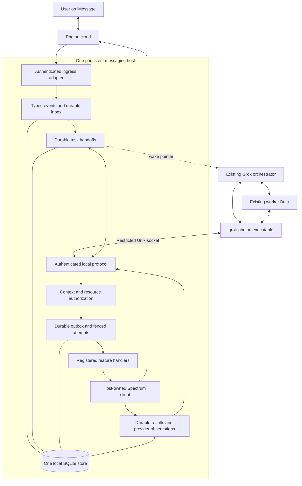

# Photon Feature Runtime architecture

Living architecture overview. Product separation updated: 2026-09-09.
Working rules: [agent.md](agent.md). Detailed behavior: [runtime contract](docs/photon-features/runtime-contract.md).

## Current repository scope

This repository contains the new Photon Feature Runtime in `packages/photon-features/`, its tests, schemas, worker operating skill, packaging tools and `docs/photon-features/` evidence. The inherited root Grok Bot CLI and its release pipeline have been removed. The root is a private npm workspace named `grokbotxphoton`; the feature package retains its existing identity to preserve imports and contracts.

All nine lane implementations are present. Integration remains incomplete: production text execution, router/poll transactional ownership and SQLite installation permissions have three reproduced failures. Four poll management operations and production host composition remain unfinished. The external Grok task/wake connection is unverified. Product separation does not resolve those defects.

Historical evidence below and under `docs/photon-features/evidence/` records the original checkout, source URLs, commits and legacy regression counts. Those records are preserved as provenance and are not the current product test inventory. Current `npm test` runs the 60 foundation tests; `npm run test:verification` runs independent offline integration/security tests.

## Purpose

A user communicates through iMessage. The existing Grok Bot orchestrator decides what to do and delegates substantive work to existing worker Bots. The Photon Feature Runtime validates, authorizes, persists and executes messaging operations deterministically. Codex builds the package and its operating skill; normal Grok operation consumes that package without generating integration code.

## Verified checkpoint

F0 commit: `57e40736be8a59047b776654c766fbe8bfd10c9e`.
Contract version, digest, exact dependencies and validation logs: [foundation.json](docs/photon-features/foundation.json).

| Evidence tier | F0 status |
| --- | --- |
| Foundation code built | Yes; 44 action schemas, shared interfaces, SQLite primitives, local protocol and registration checks |
| Messaging feature handlers | 0 of 44 implemented; schema registration is not implementation |
| Tests at checkpoint | 31 existing tests and 60 foundation tests passed; public SDK probes and schema drift checks passed |
| Parallel lane implementation | Ready against the F0 contracts |
| Integrated runtime | Not complete |
| Installed or activated | No |
| Live verified | No |

These are F0 observations, not claims about future revisions. The historical `/workspace/grok-photon-proof` path did not contain a runtime in the inspected environment; it is not assumed to be the macOS checkout or deployment.

## Target system

The diagram describes the intended integrated system. F0 supplies the foundation; it does not activate these connections.

## Boundaries and durable flows

**Incoming work:** explicitly select Photon stream or webhook ingress, verify authenticity and scope, normalize typed events, and persist inbox/reducer/handoff state transactionally before upstream acknowledgement. Wake the existing task after commit. The bot then uses `work.list`, `work.claim`, `work.heartbeat` and `work.ack` to retrieve and manage actual durable work. The wake body is neither the work record nor authorization.

**Outgoing operations:** the executable submits a strict versioned action through local IPC. The runtime resolves the authenticated principal, context and resource scope, checks current generation/permissions/capabilities, and records idempotent outbox work. A claimed executor invokes an injected feature handler through the single SDK owner, then persists results and recovery state. WT-01 supplies the durable executor; production feature/host composition still needs integration.

**Recovery:** leases and fences prevent stale database writes. Multipart children have stable identities and checkpoints. A provider call whose outcome was not persisted can remain unknown; retry requires verified deduplication or reconciliation support. A successful void operation does not need an invented message reference. Delivery/read receipts are correlated observations, distinct from executor completion or provider acceptance.

**Local trust:** Unix socket access and separate credentials authenticate cooperative principals; `contextId` only references a grant. References preserve project/provider/account/line/conversation scope and require authoritative resolution. Same-OS-account processes are one trust domain, not hostile-process isolation. There is no public command-execution endpoint.

**Storage:** one local SQLite database holds context grants, task generations, media/stream metadata, inbox/unresolved events, handoffs, outbox/attempts, multipart children, references, polls/votes, cards/sessions and checkpoints. F0 implements transactional primitives; authorization, scheduling and resource adapters still need integration.

## Module map

Implementation paths below are relative to `packages/photon-features/`. The [ownership registry](docs/photon-features/ownership.json) also defines every lane's tests, examples, requests and evidence paths.

| Owner | Responsibility and primary interfaces |
| --- | --- |
| WT-00 | `src/contracts/`, `src/state/`, `src/registry/`, `src/host/`, legacy boundary, schemas, metadata and shared composition |
| WT-01 | `src/runtime/core/`, `src/adapters/state/`; `SubmissionPort`, `TransactionStore`, `StateTables`, authorization, claims and recovery |
| WT-02 | Transport/inbound/typing; `IncomingEvent`, `IngressAdapter`, `WakeAdapter`, typing handlers |
| WT-03 | Text/message features and voice formatter; `ActionFor`, `ContentSpec`, `FeatureModule`, `ExecutionServices` |
| WT-04 | Media features; shared feature interfaces, `MediaStager`, attachment references |
| WT-05 | Poll features; shared feature interfaces, poll/option references and durable votes |
| WT-06 | App/card features; shared feature interfaces, card/session state and interactions |
| WT-07 | Native space/account/effect/metadata/custom features; scoped resources and capabilities |
| WT-08 | Executable, installer, packaging and operating skill; local protocol and host activation interfaces |
| WT-09 | Integration/security/live acceptance; fixtures, clocks, crash hooks, SQLite and registration harness |

Features receive injected SDK/resource services. They never create another client or subscribe independently. WT-00 integrates aggregate registration; production registration rejects duplicate owners and missing handlers. See the [44-operation map](docs/photon-features/operation-map.md) for per-operation ownership and public API gaps.

## Open integration decisions

- Select and verify deployment project/account/line/conversation bindings and account eligibility.
- Resolve durable-before-ack ingress and stream replay/catch-up guarantees; do not assume the SDK webhook callback delays acknowledgement.
- Verify a public provider idempotency/outcome-lookup seam and advanced poll/card/reaction mutation APIs before implementing adapters.
- Implement current context/resource authorization, guarded media staging and registered-stream lifecycle.
- Bind wake notifications to existing Grok tasks; implement task acceptance idempotency before acknowledgement.
- Add private runtime paths, a single-host process lock/supervisor, installation and explicit activation.
- Preserve the documented SDK compiler compatibility settings and SQLite experimental-API limitation until new evidence supports changes.

No advanced-provider extension is approved at F0. Missing public support remains a capability blocker; it does not justify private SDK access or another provider/client.

## Updating this document

Update the review date, affected boundary/module and evidence tier when an architectural change lands. Link new decisions and validation evidence from the owning lane; label planned or unresolved behavior explicitly. Keep the F0 checkpoint historical, add later checkpoints separately, and update the detailed contracts before claiming an incompatible change is integrated. WT-00 coordinates shared document edits.

Further references: [contract catalog](docs/photon-features/contracts-v1.md), [rollout and lane handoff](docs/photon-features/rollout.md), [source records](docs/photon-features/evidence/wt-00/sources.md), [original baseline](docs/photon-features/baseline.md).
